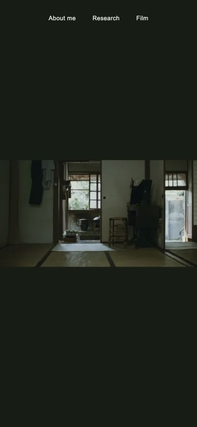

# Editing your website

Your four pages are generated from the `content` folder. You do not need to edit layout code.



## Start a local preview

Install Node 22 (22.12 or later) or a newer supported Node version. From the repository folder:

```sh
npm ci
npm run dev
```

Open the local address printed by the preview. Leave it running while you edit. Text and image changes refresh the preview. Before publishing, run `npm run build` to check everything.

## Where to edit

| Change | File |
|---|---|
| Name, email, social links, CV | `content/site.yml` |
| Opening frame and crop | `content/home.yml` |
| Biography and portrait | `content/about.md` |
| Research introduction and group labels | `content/research.yml` |
| Each research project | `content/research/*.md` |
| Each film, statement and gallery | `content/films/*.md` |
| Favorite films | `content/influences.yml` |
| Games | `content/games.yml` |
| Crew credits | `content/filmography.yml` |

Markdown files have a short settings block between `---` lines, then normal paragraphs. Keep the settings block; edit prose below it. Use `## Heading` for a section and `[link text](https://example.com)` for a link.

## Swap an image

1. Put a JPG, PNG, WebP or AVIF in `src/assets/images/`. Subfolders are supported. Use lowercase filenames without spaces.
2. In the content file, set `image` to its path relative to that folder: `films/zebra/new-still.jpg`.
3. Write descriptive `alt` text. Keep a caption/credit when relevant.

Images are resized automatically during build. Keep original full-resolution exports in your personal asset folder; use reasonably sized copies in the repo. Avoid HEIC; export JPEG first. A missing image causes a clear build error instead of a broken published picture.

For the entrance, edit `content/home.yml`:

```yaml
image: opening.webp
alt: An open doorway in a film I admire.
credit: A Time to Live and a Time to Die
focalPoint: 50% 50%
```

The focal point controls desktop cropping. On mobile the whole frame is shown. The credit appears on About, leaving the entrance minimal.

## Add, hide and reorder

Duplicate a file from `examples/` into the appropriate content folder. Give it a stable filename such as `new-film.md`. Set `draft: false` when ready. Drafts do not appear on the public pages. This is display control, not secrecy: anything committed to a public repository is still public.

Change `order` to move projects. Lower numbers appear first; research projects are ordered within their group (`craft`, `agents`, or `robotics`).

Within a film's `gallery`, move entries to change their order. Set `visible: false` to hide a still. The first visible still is the lead image. Keep at least one visible image in a published film. A caption is optional; alt text is required.

```yaml
gallery:
  - image: zebra.webp
    alt: A lone figure beside a lake at sunset.
    caption: Zebra, 2026
    visible: true
  - image: zebra-close.webp
    alt: Two people in blue and amber light.
    visible: false
```

YAML indentation matters. Use spaces rather than tabs. If text contains a colon, put it in quotes. Keep `true` and `false` unquoted.

## CV

Put the current PDF at `public/files/cv.pdf`, then set `cv: /files/cv.pdf` in `content/site.yml`. Replace that same PDF when you update it. The Research page shows the CV link automatically. `cv: null` hides it. The old dated résumé remains available at its historical URL but is not promoted as current.

## Publish using GitHub

1. Create an edit branch in the GitHub repository, then edit content files or upload images there.
2. Open a pull request to `master` and wait for the Website build check.
3. Review locally if you want to see the appearance; the check does not create a hosted preview.
4. Merge into `master`. GitHub Actions builds and publishes the site.
5. Check the Website run under Actions, then visit the live pages.

You can also make these edits locally and push an edit branch. Do not commit `dist`, `.astro`, or `node_modules`; these are generated. Do commit `package-lock.json` when dependencies change.

## If something breaks

A failed build does not replace the last deployed site. Read the error in the Actions build log; it should name the content field or image that needs attention. Revert the offending content commit or correct it, then rebuild.

The old Jekyll version is preserved at `pre-cinematic-redesign-2026-09-29`. Restoring that version also requires changing Pages back to its previous legacy build from `master` at `/`; it cannot run through the new Astro workflow unchanged.
